    <!DOCTYPE html>
<html lang ="en">

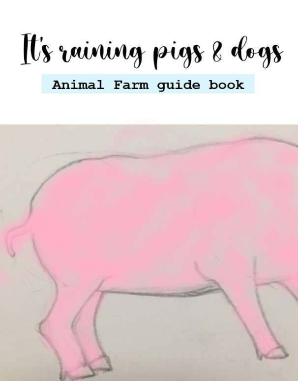 

<meta charset='UTF-8'/>
<link rel='stylesheet' href='chap1.css'/>
<body font="serif">

<h1 align="middle">Authors of this book: -  </h1>

 Members of the solvers club  

     

      
harini - 

        
        
Rithanya - 

         
      

        

        
Ankith-

        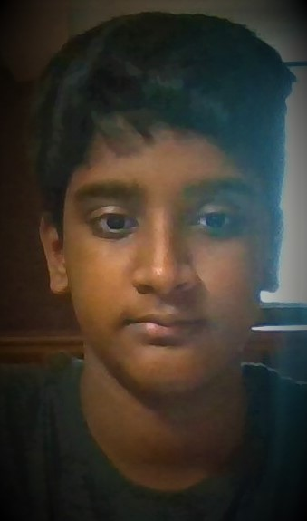
        
Karthik-

        

   

   

  

<body><h1 align="middle">Preface</h1>

 Why did we write this book? This book is a guide for Animal Farm (written by George Orwell), to help people read, understand, and visualize Animal Farm.   

Animal Farm is a very tough (but outstanding!) book, and it requires “critical thinking”. 
 
So, what is critical thinking? Critical thinking is when you ponder about all that you read. If you do “critical reading” then the book will make a lot more sense to you.

Animal Farm is such a Beautiful book with lots of twists and turns! It is very enjoyable to read. This book will help you visualize Animal Farm with the maps we put inside!

So, what are you waiting for?! 

 
 
 

<h1 align="middle">Where is animal farm located </h1>

 World map:

 Europe map: 

 England map: 

 London map: 

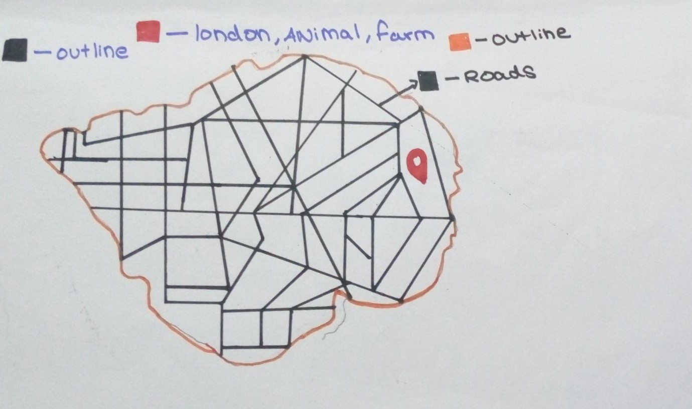

 French church street map: 

<h1 align="middle">Chapter 1 </h1>
<h1 align="middle">Poem</h1> 

Mr. Jones isn’t being good?

He should feed the animals food  

How do the animals feel?  

I think they are like a fish bitten by an eel.  

Mr. Jones is unaware,  

He is plucking the animal’s hair  

Animals are angry, they are hungry.  

I want hay! 

I feel hungry every day! 

I dreamt about glee,  

We were able to be free,  

We were stuffed, all of us were buff  

No one to torture us,  

Wouldn’t it be joyous?   

<h1 align="middle"> Animal farm book, ready to read? </h1>

Mr. Jones, of the Manor Farm, had locked the hen-houses for the night, but was too drunk to remember to shut the pop-holes.  With  the  ring  of  light  from  his  lanterndancing from side to side, he lurched across the yard, kicked off hisboots at the back door, drew himself a last glass of beer from thebarrel in the scullery, and made his way up to bed, where Mrs.Jones was already snoring.As  soon  as  the  light  in  the  bedroom  went  out  there  was  astirring and a fluttering all through the farm buildings. Word had gone round during the day that old Major, the prize Middle White boar, had had a strange dream on the previous night and wished tocommunicate it to the other animals. It had been agreed that theyshould all meet in the big barn as soon as Mr. Jones was safely outof the way. Old Major (so he was always called, though the nameunder which he had been exhibited was Willingdon Beauty) was sohighly regarded on the farm that everyone was quite ready to losean hour’s sleep in order to hear what he had to say.At one end of the big barn, on a sort of raised platform, Major was already ensconced on his bed of straw, under a lantern whichhung from a beam. He was twelve years old and had lately grownrather stout, but he was still a majestic-looking pig, with a wise andbenevolent appearance in spite of the fact that his tushes had neverbeen cut. Before long the other animals began to arrive and makethemselves comfortable after their different fashions. First came the three dogs, Bluebell, Jessie, and Pincher, and then the pigs,

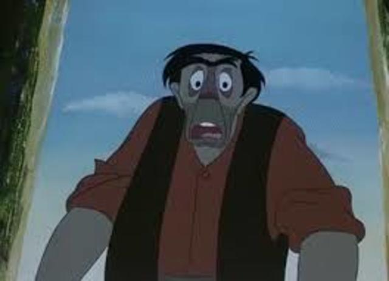

who  settled  down  in  the  straw  immediately  in  front  of  the platform. The hens perched themselves on the window-sills, thepigeons fluttered up to the rafters, the sheep and cows lay downbehind the pigs and began to chew the cud. The two cart-horses,Boxer and Clover, came in together, walking very slowly and settingdown their vast hairy hoofs with great care lest there should besome  small  animal  concealed  in  the  straw.  Clover  was  a  stoutmotherly mare approaching middle life, who had never quite go there figure back after her fourth foal. Boxer was an enormous beast,nearly  eighteen  hands  high,  and  as  strong  as  any  two  ordinaryhorses  put  together.  A  white  stripe  down  his  nose  gave  him  asomewhat stupid appearance, and in fact he was not of first-rateintelligence, but he was universally respected for his steadiness ofcharacter and tremendous powers of work. After the horses cameMuriel, the white goat, and Benjamin, the donkey. Benjamin wasthe oldest animal on the farm, and the worst tempered. He seldom talked,  and  when  he  did,  it  was  usually  to  make  some  cynicalremark — for instance, he would say that God had given him a tailto keep the flies off, but that he would sooner have had no tail andno flies. Alone among the animals on the farm he never laughed. Ifasked  why,  he  would  say  that  he  saw  nothing  to  laugh  at.Nevertheless,  without  openly  admitting  it,  he  was  devoted  toBoxer; the two of them usually spent their Sundays together in the small paddock beyond the orchard, grazing side by side and neverspeaking.The two horses had just lain down when a brood of ducklings,which had lost their mother, filed into the barn, cheeping feeblyand wandering from side to side to find some place where theywould not be trodden on. Clover made a sort of wall round themwith her great foreleg, and the ducklings nestled down inside it and

promptly fell asleep. At the last moment Mollie, the foolish, prettywhite mare who drew Mr. Jones’s trap, came mincing daintily in,chewing at a lump of sugar. She took a place near the front andbegan flirting her white mane, hoping to draw attention to the redribbons it was plaited with. Last of all came the cat, who lookedround, as usual, for the warmest place, and finally squeezed herselfin  between  Boxer  and  Clover;  there  she  purred  contentedlythroughout Major’s speech without listening to a word of what hewas saying.All  the  animals  were  now  present  except  Moses,  the  tameraven, who slept on a perch behind the back door. When Major sawthat they had all made themselves comfortable and were waitingattentively, he cleared his throat and began:“Comrades, you have heard already about the strange dreamthat I had last night. But I will come to the dream later. I havesomething else to say first. I do not think, comrades, that I shall bewith you for many months longer, and before I die, I feel it my dutyto pass on to you such wisdom as I have acquired. I have had a longlife, I have had much time for thought as I lay alone in my stall,and I think I may say that I understand the nature of life on thisearth as well as any animal now living. It is about this that I wishto speak to you.“Now, comrades, what is the nature of this life of ours? Let usface it: our lives are miserable, laborious, and short. We are born,we  are  given  just  so  much  food  as  will  keep  the  breath  in  ourbodies, and those of us who are capable of it are forced to work tothe  last  atom  of  our  strength;  and  the  very  instant  that  ourusefulness has come to an end we are slaughtered with hideouscruelty. No animal in England knows the meaning of happiness orleisure after he is a year old. No animal in England is free. The life

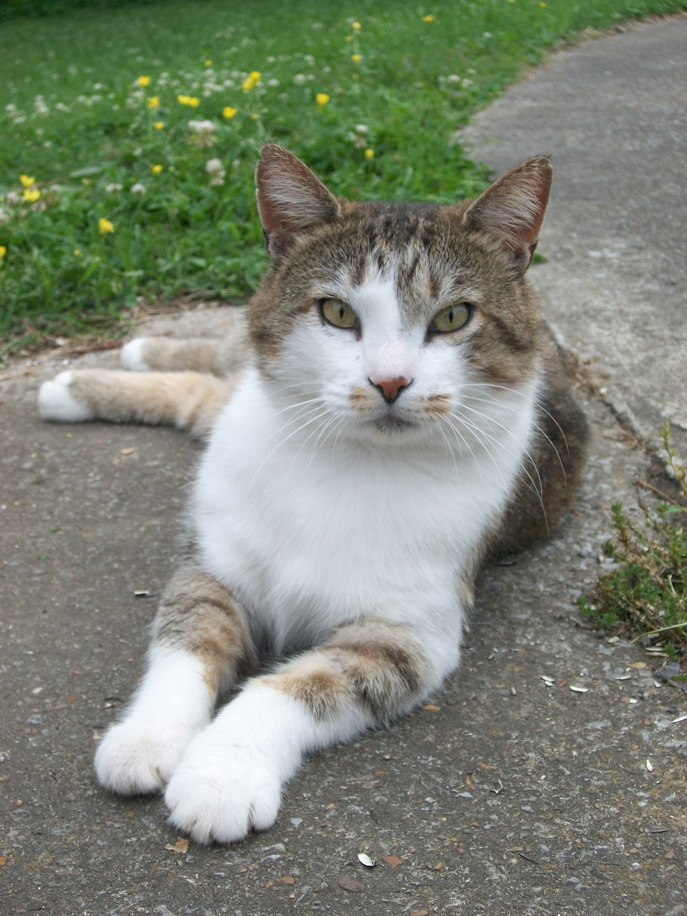

of an animal is misery and slavery: that is the plain truth.“But is this simply part of the order of nature? Is it becausethis land of ours is so poor that it cannot afford a decent life tothose who dwell upon it? No, comrades, a thousand times no! Thesoil  of  England  is  fertile,  its  climate  is  good,  it  is  capable  ofaffording food in abundance to an enormously greater number ofanimals  than  now  inhabit  it.  This  single  farm  of  ours  wouldsupport a dozen horses, twenty cows, hundreds of sheep — and allof  them  living  in  a  comfort  and  a  dignity  that  are  now  almostbeyond our imagining. Why then do we continue in this miserablecondition? Because nearly the whole of the produce of our labouris stolen from us by human beings. There, comrades, is the answerto all our problems. It is summed up in a single word — Man. Manis the only real enemy we have. Remove Man from the scene, andthe root cause of hunger and overwork is abolished for ever.“Man is the only creature that consumes without producing.He does not give milk, he does not lay eggs, he is too weak to pullthe plough, he cannot run fast enough to catch rabbits. Yet he islord of all the animals. He sets them to work, he gives back to themthe bare minimum that will prevent them from starving, and therest  he  keeps  for  himself.  Our  labour  tills  the  soil,  our  dungfertilises it, and yet there is not one of us that owns more than hisbare skin. You cows that I see before me, how many thousands ofgallons of milk have you given during this last year? And what hashappened to that milk which should have been breeding up sturdycalves? Every drop of it has gone down the throats of our enemies.And you hens, how many eggs have you laid in this last year, andhow many of those eggs ever hatched into chickens? The rest haveall gone to market to bring in money for Jones and his men. Andyou, Clover, where are those four foals you bore, who should have

 been the support and pleasure of your old age? Each was sold at ayear old — you will never see one of them again. In return for yourfour confinements and all your labour in the fields, what have youever had except your bare rations and a stall?“And even the miserable lives we lead are not allowed to reachtheir natural span. For myself I do not grumble, for I am one of thelucky ones. I am twelve years old and have had over four hundredchildren. Such is the natural life of a pig. But no animal escapes thecruel knife in the end. You young porkers who are sitting in frontof me, every one of you will scream your lives out at the blockwithin a year. To that horror we all must come — cows, pigs, hens,sheep, everyone. Even the horses and the dogs have no better fate.You, Boxer, the very day that those great muscles of yours losetheir power, Jones will sell you to the knacker, who will cut yourthroat and boil you down for the foxhounds. As for the dogs, whenthey grow old and toothless, Jones ties a brick round their necksand drowns them in the nearest pond.“Is it not crystal clear, then, comrades, that all the evils of thislife of ours spring from the tyranny of human beings? Only get ridof Man, and the produce of our labour would be our own. Almostovernight we could become rich and free. What then must we do?Why, work night and day, body and soul, for the overthrow of thehuman race! That is my message to you, comrades: Rebellion! I donot know when that Rebellion will come, it might be in a week orin  a  hundred  years,  but  I  know,  as  surely  as  I  see  this  strawbeneath my feet, that sooner or later justice will be done. Fix youreyes on that, comrades, throughout the short remainder of yourlives! And above all, pass on this message of mine to those whocome  after  you,  so  that  future  generations  shall  carry  on  thestruggle until it is victorious.

“And remember, comrades, your resolution must never falter.No argument must lead you astray. Never listen when they tell youthat  Man  and  the  animals  have  a  common  interest,  that  theprosperity of the one is the prosperity of the others. It is all lies.Man serves the interests of no creature except himself. And amongus animals let there be perfect unity, perfect comradeship in thestruggle. All men are enemies. All animals are comrades.”At this moment there was a tremendous uproar. While Majorwas speaking four large rats had crept out of their holes and weresitting  on  their  hindquarters,  listening  to  him.  The  dogs  hadsuddenly caught sight of them, and it was only by a swift dash fortheir holes that the rats saved their lives. Major raised his trotterfor silence.“Comrades,” he said, “here is a point that must be settled. Thewild creatures, such as rats and rabbits — are they our friends orour enemies? Let us put it to the vote. I propose this question tothe meeting: Are rats comrades?”The  vote  was  taken  at  once,  and  it  was  agreed  by  anoverwhelming majority that rats were comrades. There were onlyfour dissentients, the three dogs and the cat, who was afterwardsdiscovered to have voted on both sides. Major continued:“I have little more to say. I merely repeat, remember alwaysyour duty of enmity towards Man and all his ways. Whatever goesupon two legs is an enemy. Whatever goes upon four legs, or haswings, is a friend. And remember also that in fighting against Man,we  must  not  come  to  resemble  him.  Even  when  you  haveconquered him, do not adopt his vices. No animal must ever live ina house, or sleep in a bed, or wear clothes, or drink alcohol, orsmoke tobacco, or touch money, or engage in trade. All the habitsof Man are evil. And, above all, no animal must ever tyrannise over
 

his own kind. Weak or strong, clever or simple, we are all brothers.No animal must ever kill any other animal. All animals are equal.“And now, comrades, I will tell you about my dream of lastnight. I cannot describe that dream to you. It was a dream of theearth as it will be when Man has vanished. But it reminded me ofsomething that I had long forgotten. Many years ago, when I was alittle pig, my mother and the other sows used to sing an old song ofwhich they knew only the tune and the first three words. I hadknown that tune in my infancy, but it had long since passed out ofmy mind. Last night, however, it came back to me in my dream.And what is more, the words of the song also came back-words, Iam certain, which were sung by the animals of long ago and havebeen lost to memory for generations. I will sing you that song now,comrades. I am old and my voice is hoarse, but when I have taughtyou  the  tune,  you  can  sing  it  better  for  yourselves.  It  is  called‘Beasts of England’.”Old Major cleared his throat and began to sing. As he had said,his voice was hoarse, but he sang well enough, and it was a stirringtune,  something  between  ‘Clementine’  and  ‘La  Cucaracha’.

   Beasts of England, beasts of Ireland, Beasts of every land and clime, Hearken to my joyful tidings Of the golden future time. Soon or late the day is coming,Tyrant Man shall be o’erthrown,And the fruitful fields of EnglandShall be trod by beasts alone.10
 The  singing  of  this  song  threw  the  animals  into  the  wildest excitement. Almost before Major had reached the end, they had begun singing it for themselves. Even the stupidest of them hadalready picked up the tune and a few of the words, and as for theclever ones, such as the pigs and dogs, they had the entire song byheart within a few minutes. And then, after a few preliminary tries,the whole farm burst out into ‘Beasts of England’ in tremendousRings shall vanish from our noses,And the harness from our back, Bit and spur shall rust forever, Cruel whips no more shall crack. Riches more than mind can picture, Wheat and barley, oats and hay,Clover, beans, and mangel-wurzelsShall be ours upon that day.Bright will shine the fields of England,Purer shall its waters be,Sweeter yet shall blow its breezesOn the day that sets us free.For that day we all must labour,Though we die before it break;Cows and horses, geese and turkeys,All must toil for freedom’s sake.Beasts of England, beasts of Ireland, Beasts of every land and clime, Hearken well and spread my tidings Of the golden future time.

   The  singing  of  this  song  threw  the  animals  into  the  wildest excitement. Almost before Major had reached the end, they had begun singing it for themselves. Even the stupidest of them hadalready picked up the tune and a few of the words, and as for theclever ones, such as the pigs and dogs, they had the entire song byheart within a few minutes. And then, after a few preliminary tries,the whole farm burst out into ‘Beasts of England’ in tremendous.

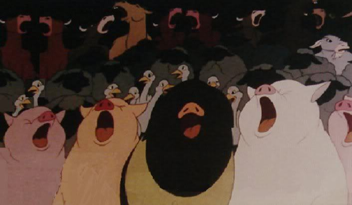

   unison. The cows lowed it, the dogs whined it, the sheep bleated it,the  horses  whinnied  it,  the  ducks  quacked  it.  They  were  so delighted with the song that they sang it right through five times insuccession, and might have continued singing it all night if theyhad not been interrupted.Unfortunately, the uproar awoke Mr. Jones, who sprang out ofbed, making sure that there was a fox in the yard. He seized thegun which always stood in a corner of his bedroom, and let fly acharge  of  number  6  shot  into  the  darkness.  The  pellets  buried themselves  in  the  wall  of  the  barn  and  the  meeting  broke  up hurriedly.  Everyone  fled  to  his  own  sleeping-place.  The  birdsjumped on to their perches, the animals settled down in the straw,and the whole farm was asleep in a moment.
 

  
  
  
 

   

 <h1 align="middle">Meanings</h1>
 <dl>

<dt> 1) Pop-holes:</dt> <dd>a hole in a fence or divider through which animals can pass,
         especially one allowing poultry access to the outside or allowing piglets
         access to the sows.</dd>

<dt> 2) Scullery: </dt> </dd> A small kitchen or room at the back of a house used for washing
         dishes and other messy household work.</dd>

<dt> 3) Ensconced:</dt>  <dd>Shelter, conceal.</dd>

<dt> 4) Tushes:</dt> <dd>A long pointed tooth, in particular a canine tooth of a male horse or pig.</dd>

<dt> 5) Chew the cud:</dt> <dd> (Of a ruminant animal) Further chew partly digested food.</dd>

<dt>5a)Ruminant:</dt><dd> An even-toed ungulate mammal that chews the cud regurgitated from its rumen.
      The ruminants comprise the cattle, sheep, antelopes, deer, giraffes, and their relatives.</dd>

<dt>5b)Rumen:</dt><dd> The large 1st compartment of the stomach.</dd>

<dt>5c)Ungulate:</dt><dd> Having hooves.</dd>

<dt>6) Seldom:</dt> <dd>In few instances. Rarely, infrequently.</dd>

<dt>7) Cynical:</dt><dd> <dd>A fault-finding captious critic.</dd>

<dt>7a)Captious:</dt><dd> Marked by an often-ill-natured inclination to stress faults and raise objections.</dd>

<dt>7b)Critic:</dt><dd> One who engages often professionally in the analysis, evaluation or appreciation of works of art or artistic performances.</dd>

<dt>8) Feebly:</dt><dd> In a way that lacks strength or force.</dd>

<dt>9) Trod:</dt> <dd>Walk in a specified way.</dd>

<dt>10) Mincing:</dt> <dd>Affectedly dainty in manner or gait; effeminate (typically used of a man).</dd> 

<dt>11) Flirting(the mane):</dt><dd>To move erratically</dd>

<dt>11a)Erratically:</dt><dd> Have no fixed course.</dd>

<dt>12) Comrade:</dt><dd> (Among people) A colleague or a fellow member of an organization.</dd>

<dt>13) Dignity:</dt><dd> The state or quality of being worthy of honour or respect.</dd>

<dt>14) Confinements:</dt><dd> The action of confining or state of being confined.</dd>

<dt>15) Ration:</dt><dd> A fixed amount of a commodity officially allowed to each person during a time of shortage, as in wartime<dd>

<dt>16) Foxhounds:</dt><dd> A dog of a smooth-haired breed with drooping ears, often trained to hunt foxes in packs over long distances.</dd>

<dt>17) Tyranny:</dt><dd> Cruel and oppressive government or rule.</dd>

<dt>17a)Oppressive:</dt><dd> Unreasonably burdensome or severe.</dd>

<dt>18) Trotter:</dt><dd> A pig's foot used as food.</dd>

<dt>19) Sows:</dt><dd> An adult female swine.<dd>

<dt>19a)Swine:</dt><dd>Any of various stout-bodied short-legged omnivorous artiodactyl mammals (family Suidae) with a thick bristly skin
and a long flexible snout</dd>

<dt>20) Hoarse:</dt><dd> Person’s Voice sounding rough (sore throat shouting).</dd>

<dt>21) Clementine and La Cucaracha:</dt><dd> these two are two tunes </dd>

<dt>22) Beasts of England:</dt><dd> A Old song which is a song of rebellion.</dd>

<dt>23) Preliminary:</dt><dd>Coming or happening before something else that is more important.<dd>

<dt>24) Uproar:</dt><dd> A lot of noise, confusion, anger, etc.</dd>
 
 
</dl>

<h1 align="middle">CHARACTERS: </h1>

1) A pig who is old___________

2) The 3 Dogs names___________

3) The white mare  ___________

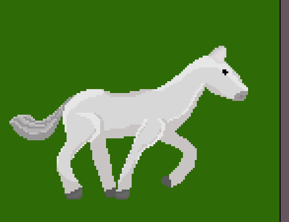

4) Who is Jones    ___________

<h1 align="middle">Things to Think</h1>

1) Old major must be nice if people will lose an hour's sleep to hear him. But what do you think!!

2) Why do you think ducklings lost their mom

3) Why do you think Mollie wants lots of attention. 

4) How did Old Major acquire the wisdom he was talking about?

5) What is the nature of the animal’s life lives?

6) Why do you think the animals are being treated like that? Without food?

7) Why do you think the animals just get slaughtered just after they worked so hard?

8) Why do you think humans don’t do the labour themselves? Shouldn't they at least feed
     the animals properly if they have to work so hard?

9) Is Twelve years being a lot for a pig? Think about it. And Old Major has had over 400 children, wow! That is a lot.

10) Why do you think humans kill all the animals after they're old and weak?

11) Why should they drown the dogs if they get old or their teeth fall? The dogs
          didn't do any harm to them! This is terrible. But think about it.

12) When do you think the rebellion will come? Before Old Major dies or after? Within a day, week, a month, a year or ten years?

13) Do you think humans are actually so cruel to animals?

14) Why do you think old major doesn’t want animals to use money, trade, houses, beds, clothes, alcohol and to smoke tobacco?

15) How do you think the words from beasts of England came to old major?

16) Do you think the animals will really like the lyrics of the song?

17) Why do you think Jones using a gun to quiet the animals? Can't he use a more calm and non-violent way? Thing we should explain.

18) Stirring and fluttering... Why? Why is that happening? What will Mr. Jones do if he finds out about the stirring and fluttering?

19) Commotion for a dream? Why? Why do you think that there will be so much commotion for just a dream?

20) Boxer is as strong as 2 ordinary horses!
          Do you think Boxer is actually that strong? Or is it just exaggeration?

21) How was Boxer known universally for his steadiness and power of work?
   

 

 

<h1 align="middle">Drawings by us </h1>

 1) jones: 

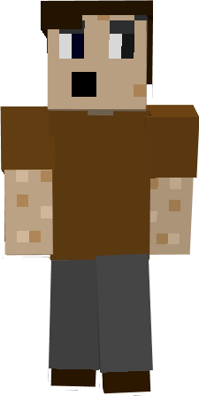

 2) pig 1: 

 3) Pig 2: 

 4) Big barn 

&nbsp;&nbsp;  <h1 align="middle">Puzzles</h1>

&nbsp;&nbsp;&nbsp;&nbsp;&nbsp;&nbsp;&nbsp;&nbsp;&nbsp;&nbsp;&nbsp;&nbsp;&nbsp;&nbsp;&nbsp;&nbsp;&nbsp;
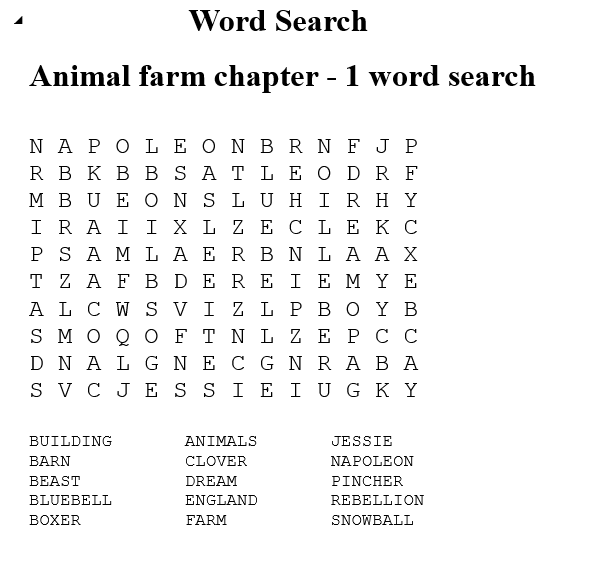 

&nbsp;&nbsp;&nbsp;&nbsp;&nbsp;&nbsp;&nbsp;&nbsp;&nbsp;&nbsp;&nbsp;&nbsp;&nbsp;&nbsp;&nbsp;&nbsp;&nbsp;&nbsp;&nbsp;
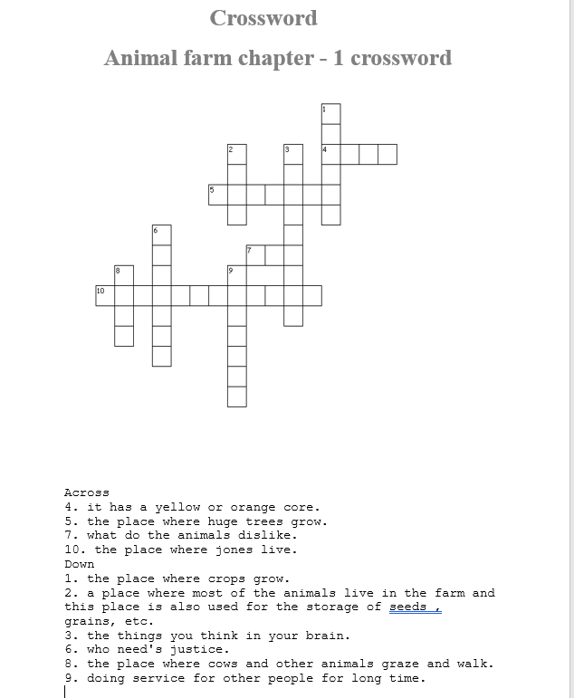

&nbsp;&nbsp;&nbsp;&nbsp;&nbsp;&nbsp;&nbsp;&nbsp;&nbsp;&nbsp;&nbsp;&nbsp;&nbsp;&nbsp;
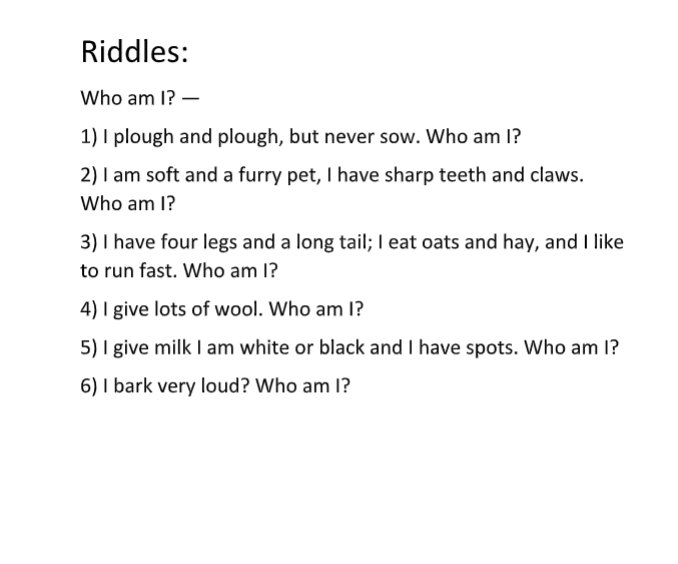

<h1 align="middle">Fun games</h1>
<h1 align="middle">Maze </h1>

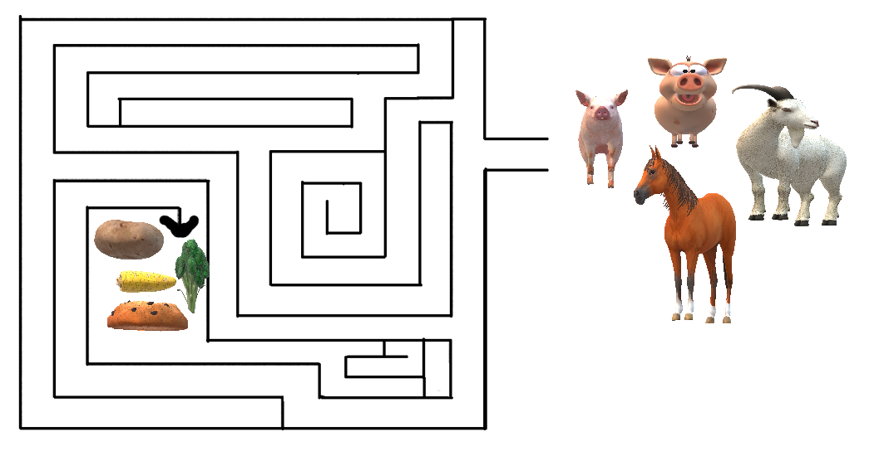

</body>

</html>
